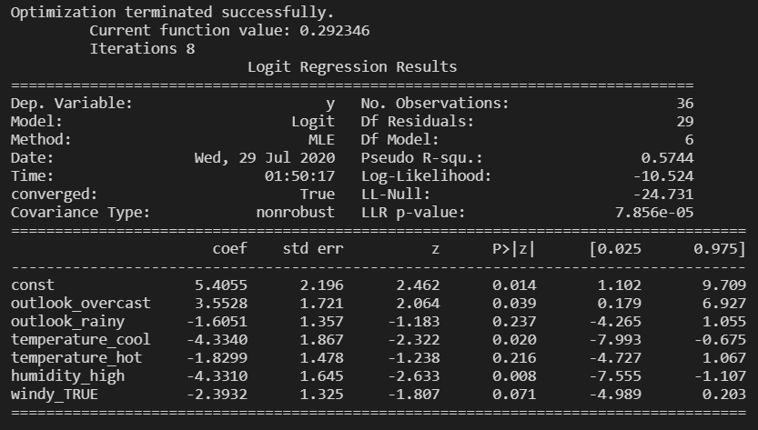

# 2. 정성적 특성 인코딩 (Data Discretization)
이번 파트를 들어가기 앞서, 정성적과 정량적에 대한 개념부터 잡고 가겠습니다.  
* 정성적(qualatative) : 자료를 묘사, 풀어씀
* 정량적(quantitive) : 자료를 수치화함

예를 들어  
**티모는 전설이다..** 라는 데이터는 정성적 데이터지만   
**티모는 3티어 챔피언이다**는 정량적 데이터인 셈이죠.  
  
그런데 저희가 필요한 데이터를 받았더니 정성적 데이터라면 어떻게 회귀분석을 진행할 수 있을까요?  
## 데이터 준비
```python
outlook = ['sunny', 'overcast', 'rainy']
temperature = ['hot', 'mild', 'cool']
humidity = ['high', 'normal']
windy = ['TRUE', 'FALSE']

weather_dataset = list()

for o in outlook : 
    for t in temperature : 
        for h in humidity : 
            for w in windy : 
                weather_dataset.append([o,t,h,w])
                
play = [0,0,1,1,1,0,1,1,0,0,0,1,1,1,1,1,1,1,1,1,0,0,1,1,0,0,0,1,0,1,0,1,0,0,0,1]
```
위와 비슷한 문제입니다. 기상청에서 제공하는 이쁜 데이터(온도 20도, 습도 10%..)가 아니라 꼬꼬마 애기들이 쓴 그림일기에서 날씨 데이터(날씨 맑음, 더움, 습함, 바람 붐)를 얻어온다고 해봅시다. 이거 가지고 어떻게 회귀분석을 할 수 있을까요?  

## Pandas를 이용한 더미 코딩
가장 쉽게 생각할 수 있는 방법은, 그냥 차례대로 숫자를 대입하는 겁니다. 맑음=1, 더움=2, 습함=3 이렇게요. 하지만 이 방법을 그대로 사용하면 서로간에 관계가 생기게 됩니다. *맑음+더움=습함* 이렇게요! 사실 서로간의 관계가 전혀 없음에도 불구하고 말이죠. 그래서 **더미(dummy)로 가변수화** 시켜주는 과정이 필요합니다.
Pandas에서는 `pandas.get_dummies` 메소드를 제공합니다. 
### 1. Pandas 데이터 프레임을 생성합니다.
```python
import pandas as pd
df = pd.DataFrame(weather_dataset, columns=['outlook', 'temperature', 'humidity', 'windy'])
df
```
  
### 2. pd.get_dummies 메소드로 더미값을 생성합니다.
```python
print(pd.get_dummies(df.humidity).iloc[:5,:])
dummy_encoding = pd.get_dummies(df)
```
  
### 3. 생성된 더미값들은 바로 회귀분석에 사용할 수 있습니다.
```python
import statsmodels.api as sm
X = sm.add_constant(dummy_encoding)
logit = sm.Logit(play, X)
result = logit.fit()
print(result.summary())
```
  
### 4. 다중공선성을 제거하기 위해 일부 더미값을 제외합니다.
```python
X.drop(['outlook_sunny', 'temperature_mild',
        'humidity_normal', 'windy_FALSE'], inplace=True, axis=1)
logit = sm.Logit(play, X)
result = logit.fit()
print(result.summary())
```
  
(제거된 더미값들은 절편(const)로 통합됩니다.)
### 단점
더미 가변수화는 데이터가 들어올 때 마다 가변수화를 진행하기 때문에 같은 종류인데 다르게 가변수화가 진행되어서 이상한 데이터셋이 생성될 수 있다는 한계가 존재합니다.  
[참고 블로그 - get_dummies](https://devuna.tistory.com/67)

## DictVectorizer, one-hot encoding  
get_dummies의 한계를 극복하기 위해 Scikit-learn에서 제공하는 DictVectorizer를 사용해봅시다. 