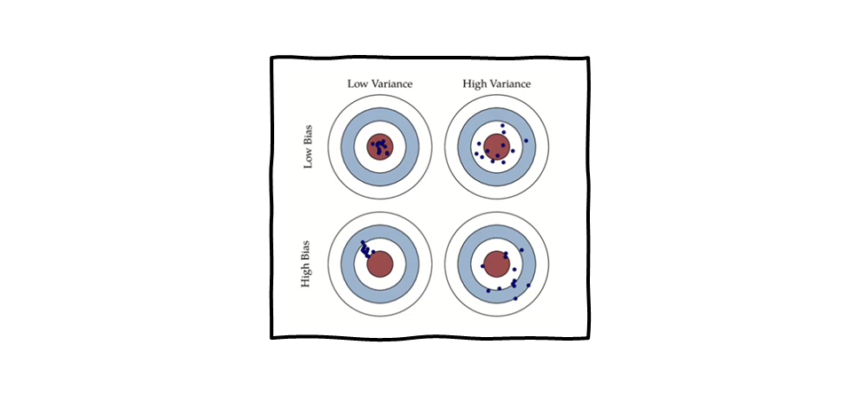
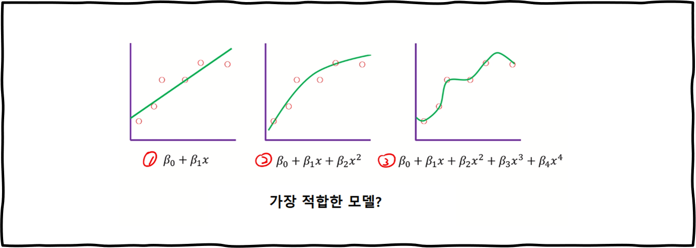
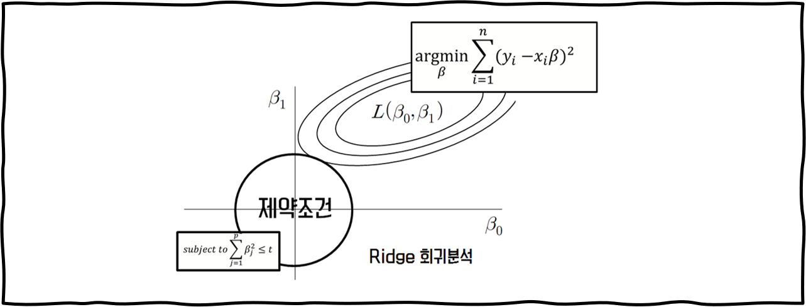
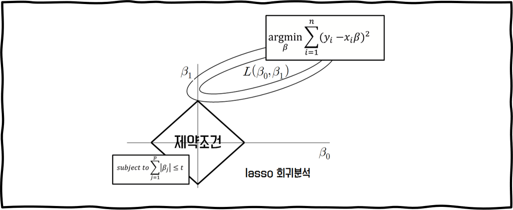

# 08. 고급 회귀분석 방법

고급에 들어가기 전에 먼저 기초부터 다지고 갑시다.  

~~(왜냐하면 전 이전 챕터 맡으신 분들을 믿지 않거든요)~~    

　    

　    

좋은 모델이란 어떤 모델을 말하는 걸까요?  

현재 데이터(training data)를 잘 설명하면서도 미래 데이터(testing data)에 대한 예측을 잘하는 친구라면 좋은 모델이라고 불러줄 수 있지 않을까요?  

* **Explanatory modeling** : 현재 데이터(training data)를 잘 설명하는 모델

* **Predictive modeling** : 미래 데이터(testing data)에 대한 예측 성능이 좋은 모델

정확도를 의미하는 MSE(Mean Squared Error)를 전개하면 Irreducible Error + Bias^2 + Variance로 나눌 수 있습니다.  

하지만 여기서 Irreducible Error은 저희가 바꿀 수 없는 값이므로 Bias와 Variance를 최대한 줄여야겠죠?  

그렇다면 그림으로 Bias와 Variance에 대해 조금 더 insight를 얻어볼께요.

　      

- 중앙에 가까울수록 정확합니다.
- 낮은 Bias와 낮은 Variance를 가질수록 오차가 적어집니다.
- Bias는 제곱을 취해서 증가량이 기하급수적이지만, 그보다 Variance의 감소량이 많다면 오차는 감소합니다.
- 따라서 Bias와 Variance 중에 무엇을 줄이는게 현명한지는 단정할 수 없습니다.

　        

## 기존 회귀분석 방법

### LSM

원래 저희가 쓰던 방법은 LSM(Least squared estimation method, 최소제곱법)이에요.  

  

**(실제 값 - 예측 값)^2의 합이 최소가 되는 계수 값 베타를 찾자** 라는 의미죠.  

LSM은 Bias가 없기 때문에 상당히 성능이 좋다고 볼 수 있습니다.  

그럼 너가 바로 Good Model이니?   

　  

### Subset Selection

　  

　  

꼭 그렇다고 볼 수는 없습니다.  

bias를 가지면서도 variance가 엄청 작은 모델은 LSM보다 좋을 수 있기 때문이죠.  

　  

위의 생각에서 나온 것이 바로 Subset selection method입니다.  

모든 독립변수 x를 사용하는 것이 아닌, 일부(subset)만 선택(selection)하여 회귀 계수를 추정하는 방법이죠.  

이는 LSM보다 bias는 증가할지 몰라도 전체 variance가 감소하기 때문에 LSM보다 더 좋은 성능을 낼 수 있었습니다.  

여기서 **정규화**에 대한 개념이 등장합니다.  

　  

## 정규화(Regularization)

### Concept

  

3번 모델은 현재 데이터(training data)에는 적합할 지 몰라도,(bias가 작음)  

미래 데이터(testing data)에는 적합하지 않은 모델이라고 볼 수 있습니다.(variance가 큼)  

이를 해결하기 위해서 **모델 복잡도에 대한 penalty를 부과**하는 방법을 사용합니다. 

  

모델은 오차를 최소화하기 위해 β3와 β4에게 작은 값을 줄 것입니다.  

결국 모델이 전반적으로 일반화(regularization)되는 결과를 낳게 되죠.  

  

가장 기본적인 form은 위와 같습니다.  

하이퍼 파라미터 λ를 설정하여 (1)과 (2) 사이의 트레이드 오프를 적절하게 조절합니다.   

결국, Regularization이란 bias를 늘리더라도 variance를 확실히 낮춰 정확도를 높이는 방법입니다.  

　  

### Ridge Regression

  

제일 처음 Regularization을 도입한 모델입니다.  

***β제곱값의 합이 하이퍼 파라미터 t보다 작다*** 라는 penalty를 가진 방법이죠.  

 

위의 두 조건을 만족시키는(두 도형의 교차점)이 바로 Ridge Regression이 찾고자 하는 값입니다.   

　  

### LASSO

Least Absolute Shrinkage and Selection Operator(LASSO)는 Ridge Regression과는 다르게  

***β의 절대값의 합이 하이퍼 파라미터 t보다 작다*** 라는 penalty를 가진 Regularization 방법입니다.

  

LASSO는 제약 조건이 마름모꼴 형태입니다.  

LASSO는 어떤 베타를 죽이고 어떤 베타를 살릴 것인지 선택할 수 있지만,  

하지만 L1 Distance(절대값)을 사용하기 때문에 미분을 못해서 Optimization하기가 힘듭니다.  

그래서 이를 가능케 해주는 알고리즘이 바로 LARS 알고리즘입니다. 

　  

### LARS

1. 베타 값을 0으로 초기화한다.

2. y와 상관계수가 가장 높은 x_j를 찾는다

3. 계수 베타를 y 상관계수의 방향으로 조금씩 증가시킨다.

   중간에 계속 잔차 (r = y-y햇)을 계산하셈

   다른 x_k가 x_j의 잔차랑 비슷해지면 멈추셈

4. 베타_j랑 베타__k를 증가시키셈 지를 교차점 방향으로

   x_m이 잔차 r만큼 상관계수를 가지면 멈추셈

5. 베타_j랑 베타_k랑 베타_m을 증가시키셈 지를 교차점 방향으로

   x_n이 잔차 r만큼 비슷해지면